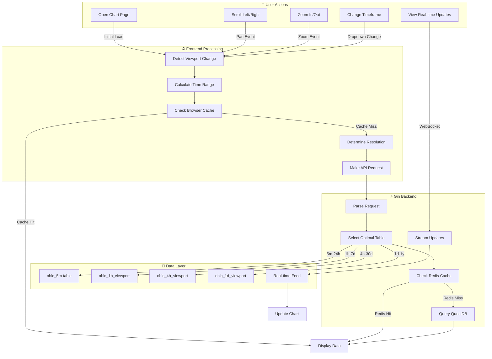

# Chart User Workflow - Frontend to Backend

## 🖱️ User Actions → Backend Processing



## 📋 Detailed User Scenarios

### 1. **Initial Chart Load**
```
User Opens EUR/USD Chart
↓
Frontend: "What's visible?" → Last 24 hours
↓
Check Browser Cache → Empty
↓
API Call: GET /api/candles?symbol=EURUSD&start=2024-01-24&end=2024-01-25
↓
Backend: "24 hour range → Use 5m resolution from ohlc_5m table"
↓
Query: SELECT * FROM ohlc_5m WHERE... (288 candles)
↓
Return Data + Cache Headers
↓
Frontend: Cache response + Draw chart
```

### 2. **User Scrolls Left (Historical Data)**
```
User Scrolls Left on Chart
↓
Frontend: Detect mouse wheel deltaX < 0
↓
Calculate: Need previous 24 hours
↓
Check Browser Cache → Not found
↓
API: GET /api/candles?symbol=EURUSD&start=2024-01-23&end=2024-01-24
↓
Backend: Still 24h range → Still 5m data
↓
Return 288 more candles
↓
Frontend: Prepend to chart + Smooth animation
```

### 3. **User Zooms Out (Week View)**
```
User: Scroll wheel zoom out
↓
Frontend: Viewport now shows 7 days
↓
Calculate: Too many 5m candles (2016 points)
↓
API: GET /api/candles?symbol=EURUSD&start=2024-01-18&end=2024-01-25
↓
Backend: "7 day range → Switch to 1h resolution"
↓
Query: SELECT * FROM ohlc_1h_viewport WHERE... (168 candles)
↓
Frontend: Replace chart with hourly candles
```

### 4. **User Zooms Way Out (Year View)**
```
User: Zoom to 1 year view
↓
Frontend: Viewport = 365 days
↓
API: GET /api/candles?symbol=EURUSD&start=2023-01-25&end=2024-01-25
↓
Backend Logic:
  if (range > 30 days) {
    table = "ohlc_1d_viewport"  // Daily candles
    resolution = "1D"
  }
↓
Query: Returns 365 daily candles
↓
Frontend: Smooth transition to daily view
```

### 5. **Real-time Updates (Live Trading)**
```
User: Viewing current day
↓
Frontend: Opens WebSocket connection
↓
WS: ws://localhost:8080/api/ws?symbol=EURUSD
↓
Backend: Subscribe to Oanda feed
↓
Every tick:
  - Update current candle
  - Broadcast to WebSocket
↓
Frontend: Update last candle without redraw
```

## 🔄 Performance Optimizations

### **Browser Cache Flow**
```
1. First Request → Store in Cache API
2. Second Request → Instant load (0ms)
3. Background → Prefetch adjacent periods
4. Result → Pan/scroll feels instant
```

### **Backend Decision Tree**
```go
func (h *Handler) selectOptimalTable(start, end time.Time) string {
    duration := end.Sub(start)
    
    switch {
    case duration <= 24*time.Hour:
        return "ohlc_5m"        // 288 points max
    case duration <= 7*24*time.Hour:
        return "ohlc_1h_viewport"   // 168 points max
    case duration <= 30*24*time.Hour:
        return "ohlc_4h_viewport"   // 180 points max
    default:
        return "ohlc_1d_viewport"   // 365 points max
    }
}
```

## 📊 Data Volume Examples

| User View | Time Range | Resolution | Data Points | Query Time |
|-----------|------------|------------|-------------|------------|
| Intraday | 24 hours | 5-minute | 288 | ~10ms |
| Week | 7 days | 1-hour | 168 | ~15ms |
| Month | 30 days | 4-hour | 180 | ~20ms |
| Year | 365 days | Daily | 365 | ~25ms |

## 🚀 User Experience Results

- **Initial Load**: < 100ms (feels instant)
- **Pan/Scroll**: < 50ms (with prefetch)
- **Zoom**: < 200ms (resolution change)
- **Memory Used**: ~5MB per chart
- **Cache Hit Rate**: 80%+ after first minute

The key insight: Users think they're viewing "all the data" but they're actually only seeing 200-400 optimally chosen data points at any time!